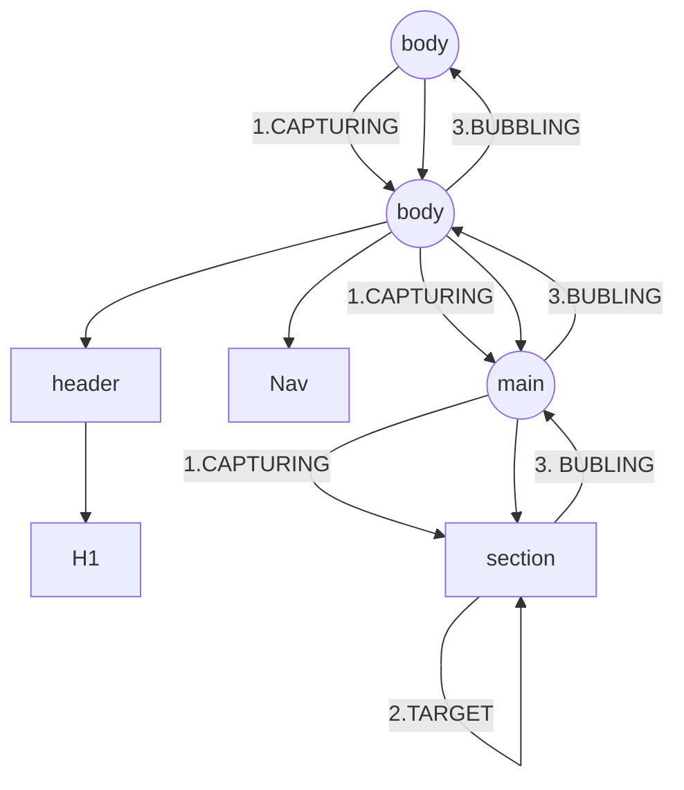

# _Eventos en el dom_

## Metodo adeacuado para hacer un evento

```sh
addEventListener
```

-   ✨Ejemplo✨

```sh
const clickTitulo = (e) => {
    console.log(e);
}
const titulo2 = document.getElementById('tituloForm');
titulo2.addEventListener('click', clickTitulo);
// Metodo para rem over el evento
//titulo2.removeEventListener('click', clickTitulo);
```

### Eventos mas importantes y mas utilisados

```sh
document.addEventListener('DOMContentLoaded', () => {
    console.log('el evento se a ejecutado');
});
```

este metodo nos indica que la carga del html del navegador a cargado

-   👁️ Ojo 👁️

> Esto no indica que la carga de imagens, videos, ni elementos asociados, si se esta usando defer no es necesario usar este metodo

### Envio de data de un formulario

```sh
const form = document.querySelector('#formulario');

const enviarFormulario = (event) => {
    event.preventDefault();
    //! destructurin
    const { name, email, password } = event.target;
    console.log(
        name.value,
        email.value,
        password.value);
}

form.addEventListener('submit', enviarFormulario);

```

### Event BUBBLING

1.CAPTURING
2.TARGET
3.BUBBLING (NO SIEMPRE)


